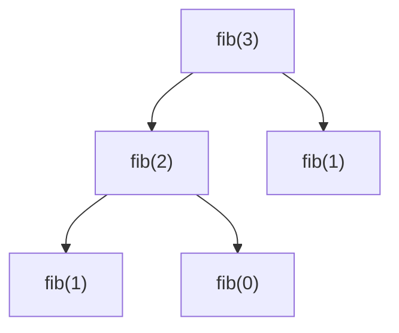

# Rekursion

Rekursion ist eine Problemlösungsstrategie.
Ihr besonderes Merkmal ist, dass sie komplexe Probleme aufteilt und sich dann für diese Unterprobleme selbst aufruft.
Dabei besteht ein rekursiver Algorithmus immer aus zwei Teilen:

- **Base Case:** Falls ein Problem so einfach ist, dass man es sofort lösen kann, wird das Ergebnis zurückgegeben.
Bei einer rekursive Zahlenfolge könnten das zum Beispiel die Grundwerte sein.

- **Problemaufteilung:** In der Problemaufteilung wird das Problem in beliebig viele Sub-Probleme unterteilt.
Diese werden dann gelöst, zusammengesetzt und zurückgegeben.

In Pseudocode könnte es also so aussehen:
```
funktion rekursiv(n) {
  wenn einfach zu lösen
    dann gib lösung zurück
  sonst
    teile Problem in Unterprobleme auf
    führe dich selbst erneut aus
    gib zusammengesetzte Ergebnisse zurück
}
```
Hierbei sind Zeile 2-3 *Base Case*, Zeile 4-7 *Problemaufteilung*.

### Fibonacci
Ein Standardbeispiel für die Rekursion ist die *Fibonacci*-Sequenz.
Diese ist definiert wie folgt:

$$
fib(n) =
\begin{cases}
fib(n - 1) + fib(n - 2) & n > 1 \\
1 & n = 0 \lor n = 1
\end{cases}
$$

Das bedeutet: Ein Element der Fibonacci-Sequenz ist immer die Summe seiner beiden Vorgänger, wobei die ersten beiden Stellen den Wert eins haben.


Die ersten zehn Elemente der Folge sind also:
$$
1; 1; 2; 3; 5; 8; 13; 21; 34; 55
$$

In der Java-Implementierung sieht das ganze so aus:
```java
int fib(int n) {
  if (n == 0 || n == 1) return 1; // Base Cases

  return fib(n -1) + fib(n - 2) // Problemaufteilung
}
```
Zeichnet man nun ein Aufrufdiagramm, so wird ein Problem der Rekursion schnell deutlich:
Der gleiche Wert wird mehrmals berechnet.

Am Aufrufdiagramm von des dritten Werts kann man das ganze schon sehen:


`fib(1)` wird zweimal ausgeführt. Nun macht dies beim ersten Wert keinen großen Unterschied, bei höheren Werten kann dies aber sehr schnell ins Gewicht fallen - schließlich steigt die anzahl der Aufrufe mit $2^n$.
&rarr; Laufzeit: $\Theta(2^n)$

Als Lösung lässt sich Caching einsetzen:
Wenn wir einen Wert berechnen, speichern wir ihn ab - Dann müssen wir beim nächsten Aufruf der Funktion nicht wieder die ganze Rechnung von vorne machen.
Eine Implementierung in Java könnte so aussehen:
```java
List<Integer> cache = new ArrayList<>(Arrays.asList(0, 1));

int fib(int n) {
    if (cache.size() <= n) cache.add(fib(n - 1) + fib(n - 2));
    
    return cache.get(n);
}
```
In Zeile 1 wird eine `ArrayList` initialisiert, die unsere Werte festhält.
Wird nun die Funktion `fib(n)` aufgerufen, prüft diese als erstes, ob der Wert schon darin enthalten ist.
Dafür muss sie bloß die Länge der Liste mit dem angefragten Index vergleichen.
Dies funktioniert, da an die Liste nur angehängt wird und dank der Rekursion alle Werte von klein nach groß eingetragen werden.
Ist die Länge der Liste kleiner als der angefraget Index, dann ist der Wert noch nicht berechnet und er wird angehängt (Z. 4).
Nun wird der Wert zurückgegeben (Z. 6)
So wird jeder Wert also nur ein mal berechnet, die Laufzeit ist $\Theta(n)$.

### Hanoi
"Die Türme von Hanoi" ist ein Spiel des französischen Mathematikers Édouard Lucas.
Darin existieren drei gleich große Stäbe $A$, $B$ und $C$.
Auf $A$ steckt ein Stapel Scheiben, jede kleiner als die darunter.
Ziel des Spiels ist es, alle Scheiben von $A$ auf einen der beiden anderen Stäbe zu verschieben.
Dabei ist die entscheidende Einschränkung, dass eine Scheibe nie auf einer kleinerern aufliegen darf.

#### Lösungsstrategie


Der Lösungsansatz lässt sich in folgende Schritte aufteilen:
1. Alle Scheiben bis auf die unterste von $A$ nach $B$ verschieben ($Z(n-1)$)
2. Die übrige Scheibe auf $C$ setzen ($1$)
3. Den Stapel auf $B$ nach $C$ verschieben ($Z(n-1)$)
Die Anzahl der zu verschiebenden Scheiben ist in Klammern notiert, $n$ bezeichnet die Anzahl der Scheiben im Anfangszustand.

Möchte man die Anzahl der minimal benötigten Schritte bestimmen, so lautet die Formel
$$ Z(n) = 2 * Z(n - 1) + 1$$

$2*Z(n-1)$ stellt dabei Schritte eins und drei, $+1$ Schritt zwei dar.

#### Implementierung
##### Rekursiv
Die Implementierung sieht wie folgt aus:
```java
int hanoiRec(int n) {
  if (n == 1) return 1; // Base Case

  return 2 * hanoiRec(n - 1) + 1; // Problemaufteilung
}
```
Laufzeit: $\Theta(2^n)$

Der Base Case ist $n=1$: Wenn nur eine Scheibe verschoben werden soll, dann dauert das genau einen Zug.
Die Problemaufteilung implementiert exakt die oben genannte Funktion.

#### Explizit
Die Anzahl der notwendigen Züge lässt sich auch explizit bestimmen:
$$
Z(n) = 2^n - 1
$$
Laufzeit: $\Theta(n)$

### Hofstadter Q-Sequenz
$$
Q(n) =
\begin{cases}
Q(n - Q(n - 1) + Q(n - Q(n - 2))) & n > 2 \\
1 & n = 1 \lor n = 2
\end{cases}
$$

#### Aufrufdiagramm
für $Q(4)$


### Quellcode
Mein Quellcode ist einsehbar unter [https://github.com/Skn0tt/lkAlgorithmik/tree/master/Rekursion](https://github.com/Skn0tt/lkAlgorithmik/tree/master/Rekursion)
