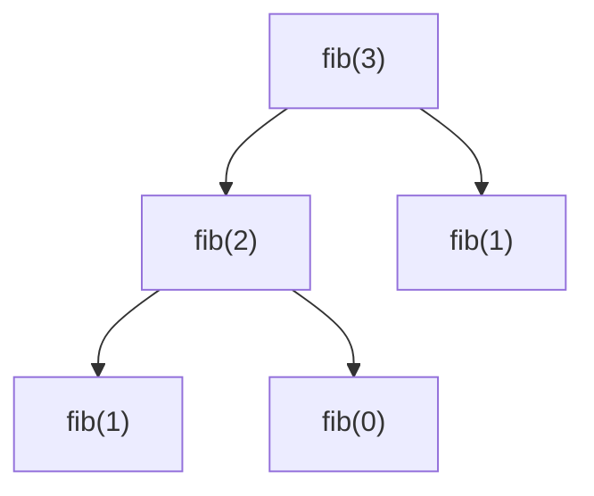

# Rekursion

* Problemlösungsstrategie
* Merkmal: Ruft sich selbst auf

Pseudocode:
```
funktion rekursiv(n) {
  wenn einfach zu lösen
    dann gib lösung zurück
  sonst
    teile Problem in Unterprobleme auf
    führe dich selbst erneut aus
    gib zusammengesetzte Ergebnisse zurück
}
```
Dabei nennt sich die erste Bedingung *Base Case*,
die zweite *Problemaufteilung*.

### Hanoi
Altes asiatisches Spiel
**Idee:** Drei Stäbe stecken im Boden. Auf einem davon sind von groß nach klein Scheiben aufgeschichtet.
**Ziel:** Den Stapel von einem Stab zu anderem verschieben
**Catch:** Eine Scheibe darf nie auf einer kleineren liegen

#### Lösungsstrategie


Die minimal benötigte Anzahl der Züge $Z$ in Abhängigkeit von der Anzahl der Scheiben $n$ sei $Z(n)$.
Ansatz: $$ Z(n) = 2 *  Z(n - 1) + 1$$

#### Implementierung
##### Rekursiv
```java
int hanoiRec(int n) {
  if (n == 1) return 1; // Base Case

  return 2 * hanoiRec(n - 1) + 1; // Problemaufteilung
}
```
Laufzeit: $\Theta(2^n)$

#### Explizit
$$
Z(n) = 2^n - 1
$$
Laufzeit: $\Theta(n)$

### Fibonacci
Beispiel:
```java
int fib(int n) {
  if (n == 0 || n == 1) return 1; // Base Cases

  return fib(n -1) + fib(n - 2) // Problemaufteilung
}
```
Problem: Aufwendig, `fib(1)` wird zweimal ausgeführt... $\Theta(2^n)$


Deshalb Lösung: Caching
```java
List<Integer> cache = new ArrayList<>(Arrays.asList(0, 1));

int fib(int n) {
    if (cache.size() <= n)
      cache.add(fib(n - 1) + fib(n - 2));
    return cache.get(n);
}
```
Bereits berechnete Werte werden zwischengespeichert, jeder Wert wird somit nur 1mal errechnet
&rarr; Bessere Laufzeit $\Theta(n)$

### Hofstadter Q-Sequenz
$$
Q(n) =
\begin{cases}
Q(n - Q(n - 1) + Q(n - Q(n - 2))) & n > 2 \\
1 & n = 1 \lor n = 2
\end{cases}
$$

#### Aufrufdiagramm
für $Q(4)$
